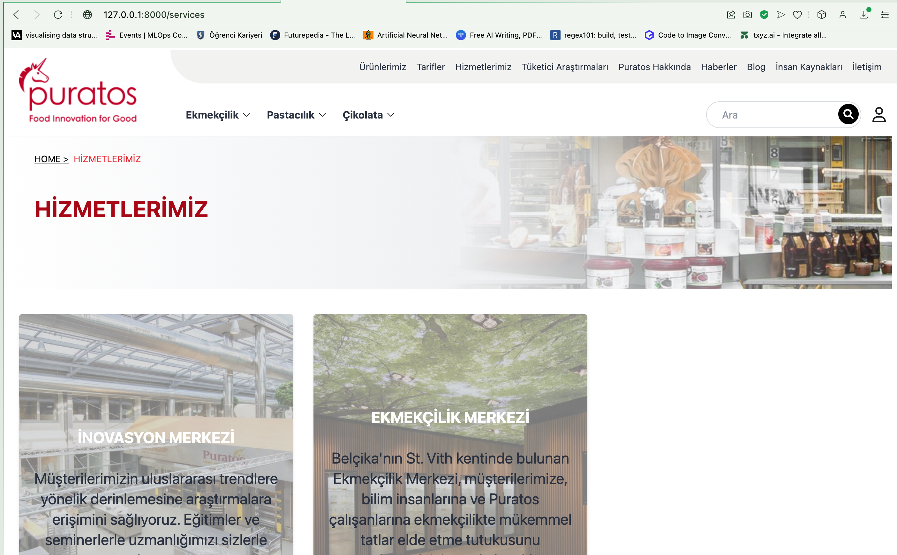

## PURATOS MOCK UP LISTING PROJECT

Product listing project developed with Laravel.

## Installation

How to set up the environment:

```bash
# Clone the repository
git clone project/link

# Go to project
cd project-name

# Install necessary packages
composer install
npm install

# create .env file
cp .env.example .env

# Generate key
php artisan key:generate

# Do the migrations
php artisan migrate

#run the following commands
php artisan serve
npm run dev

```


## Screenshots


### Homepage


###Products Page


###Recipes Page


###Services Page



###News Page


###Contact Us Page


###Admin Dashboard


###Admin Management Page


###Admin Edit Page


